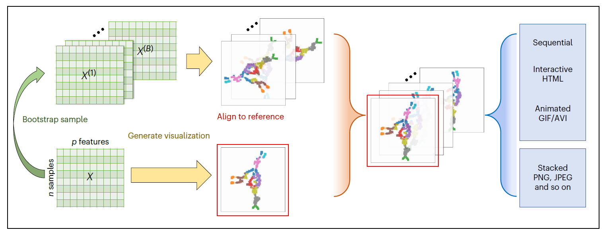

# Dynamic visualization

### Eric Sun

Python package for generating bootstrap visualizations of high-dimensional data. Great for assessing stability of visualizations and increasing robustness of interpretations. Also included are methods for computing variance scores along with classical concordance scores for quantifying the quality of a visualization.

For a Quick Start guide, please refer to ``` tutorial.ipynb ```.



## Installation and setup

### Option 1: PyPI

Install the package through PyPI with ```pip```. We recommend setting up a conda environment (or another virtual environment) first since ```dynamicviz``` currently relies on specific versions for its dependencies:

```
conda create -n myenv python=3.8
conda activate myenv

pip install dynamicviz
```


### Option 2: Github

Another way to install the package along with associated test and tutorial files is to clone the directory and then install the requirements for using the package. To do this, first clone the repository using git (you can install git following the instructions [here](https://github.com/git-guides/install-git)):

```
git clone https://github.com/sunericd/dynamicviz.git
```

We recommend setting up a conda environment to install the requirements for the package (instructions for installing conda and what conda environment can do can be found [here](https://docs.conda.io/projects/conda/en/latest/user-guide/install/index.html)). Installation of requirements can then be done with the following commands:

```
conda create -n dynamicviz python=3.8
conda activate dynamicviz

cd dynamicviz
pip install -r requirements.txt
```

To test that the installation is working correctly, you can use the Jupyter notebook ```tutorial.ipynb``` (requires installing Jupyter, instructions found [here](https://jupyter.org/install), and adding the conda environment we just created to the Jupyter notebook kernels, instructions found [here](https://medium.com/@nrk25693/how-to-add-your-conda-environment-to-your-jupyter-notebook-in-just-4-steps-abeab8b8d084)) or the test script ```test.py``` to check against expected outputs of the key methods.

For the test data in the tutorial notebook, expected run times are under 5 minutes for interactive visualization and under 10 minutes for global variance score calculation.

For Jupyter notebooks and Python scripts associated with our original publication, please refer to https://github.com/sunericd/dynamic-visualization-of-high-dimensional-data

If you find this code useful, please cite the following paper:

Sun, E.D., Ma, R. & Zou, J. Dynamic visualization of high-dimensional data. Nat Comput Sci 3, 86–100 (2023). https://doi.org/10.1038/s43588-022-00380-4
